***
# <h1 align="center"> 💥7 Days of Code💥 </h1>
***


## 📄Descripción del proyecto

```sh

¡Presentamos la campaña 7daysofcode, una iniciativa de Alura, exclusivamente para los participantes  
del ONE!
Durante 7 días, te enfrentarás a desafíos prácticos que van desde estructuras de control de flujo  
hasta funciones y manipulación de datos.

```

## 📃Objetivos de aprendizaje

```sh

- Fortalecer tu base técnica.
- Prepararte para resolver problemas complejos.
- Aumentar tu confianza al resolver desafíos prácticos.

```

## 🛠️Recursos y herramientas utilizados

```sh

- Trello: para organizar las tareas y el progreso del proyecto.
- Discord: para comunicarse con los compañeros y aclarar dudas.
- Cursos y formaciones de Alura Latam: para consultar contenidos relevantes y obtener más información.
- GitHub: para publicar y compartir el código del proyecto.
- LinkedIn: para conectarse con la comunidad y mostrar el aprendizaje adquirido.

```

## 📒Pasos a seguir

```sh

- Recibirás un correo diario con:
  - Contexto del desafío.
  - Tarea del día.
  - Materiales exclusivos para apoyar tu progreso.

```
## 📑Características

- Generación aleatoria de números secretos.

- Interfaz simple y fácil de usar.

## 🌀Tecnologías Utilizadas

✔️HTML

✔️CSS

✔️JavaScript

## 💻Instalación

```sh
Para probar la funcionalidad de "Adivinar el número", simplemente visita el siguiente enlace: 

```
### ***[Link a la página para probar Adivinar el número (https://jortiz112.github.io/challenge-amigo-secreto-julio/)](https://jortiz112.github.io/challenge-amigo-secreto-julio/ "Realizado por: Ing. Julio César Ortiz Pabón")***

## 🔆Resultados del 7DaysOfCode 1

>> 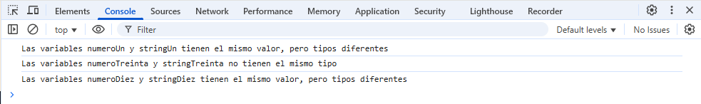

## 🔆Resultados del 7DaysOfCode 2

>> 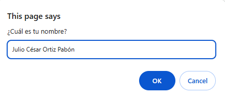

>> 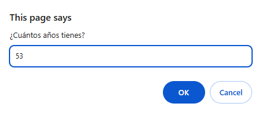

>> 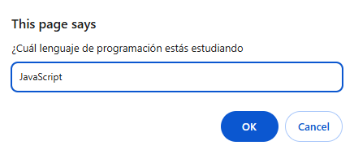

>> 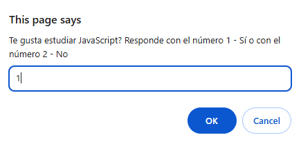

>> 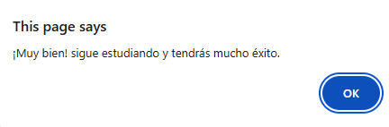

## 🔆Resultados del 7DaysOfCode 3

>> 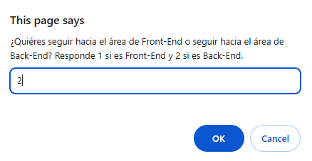

>> 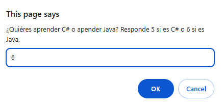

>> 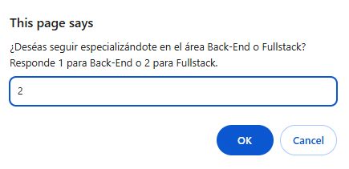

>> 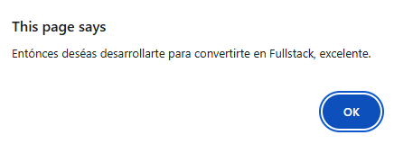

>> 

>> 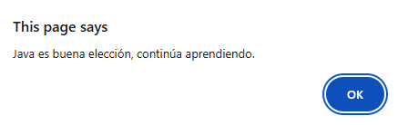

>> 

>> 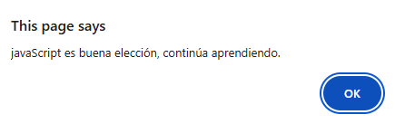

>> 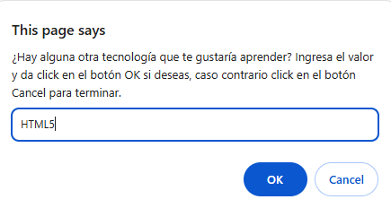

>> 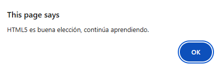

>> 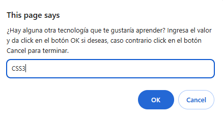

>> 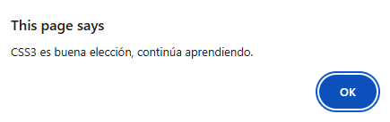

>> 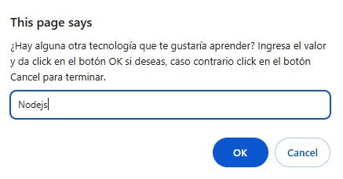

>> 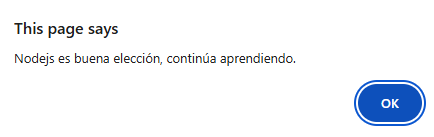

>> 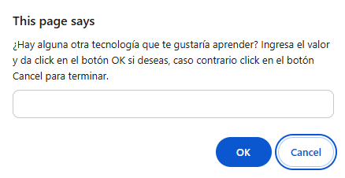

>> 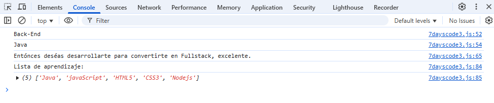

## 🔆Resultados del 7DaysOfCode 4

>> 

>> 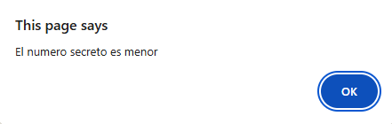

>> 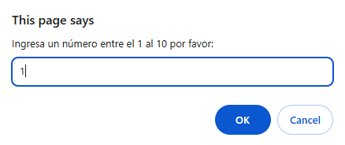

>> 

>> 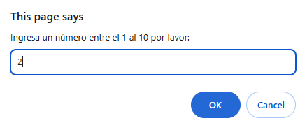

>> 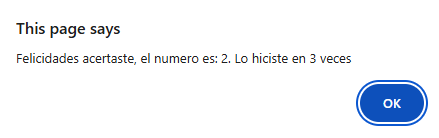  En caso de adivinar el número.

>>   En caso de no adivinar el número en los 3 intentos que se tiene.

## 🔆Resultados del 7DaysOfCode 5

>> 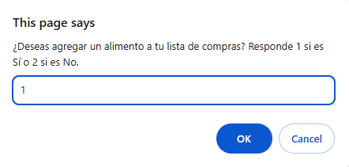

>> 

>> 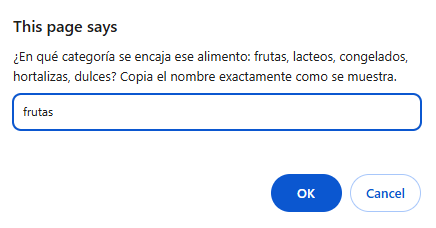

>> 

>> 

>> 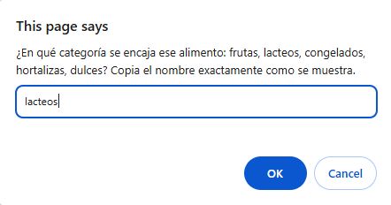

>> 

>> 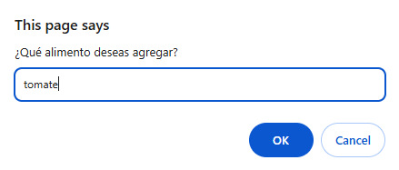

>> 

>> 

>> 

>> 

>> 

>> 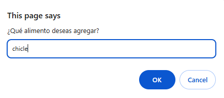

>> 

>> 

>> 

>> 

>> 

>> 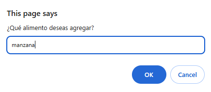

>> 

>> 

>> 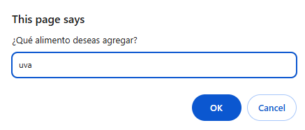

>> 

>> 

>> 

>> 

>> 

>> 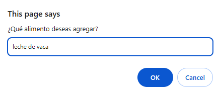

>> 

>> 

>> 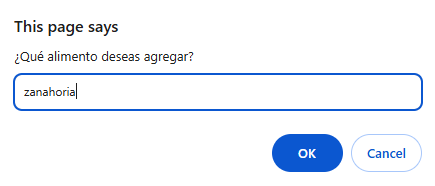

>> 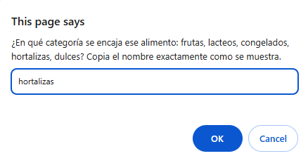

>> 

>> 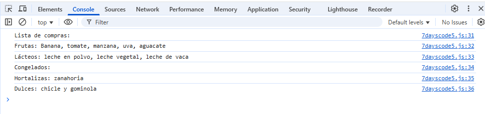

## 🔆Resultados del 7DaysOfCode 6

>> 

>> 

>> 

>> 

>> 

>> 

>> 

## 🔆Resultados del 7DaysOfCode 7

>> 

>> 

>> 

>> 

>> 

>> 

>> 

## 👩👨Autores del Proyecto

>>     Programación JavaScript, HTML y CSS
>                               
>>>   Desafíos 7DaysOfCode


